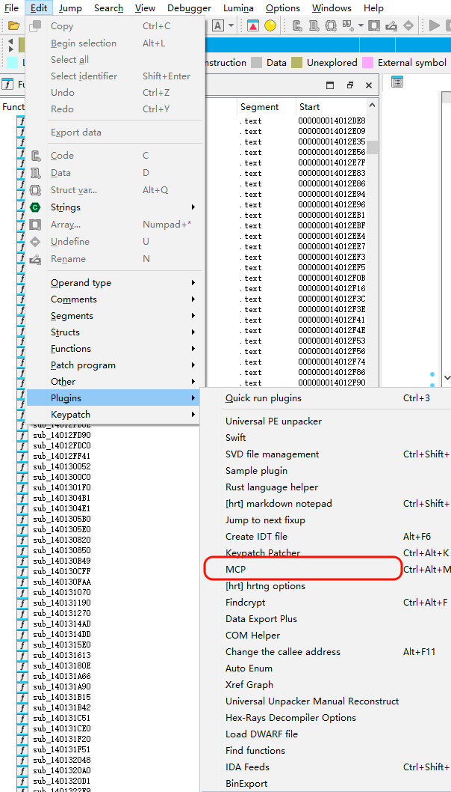
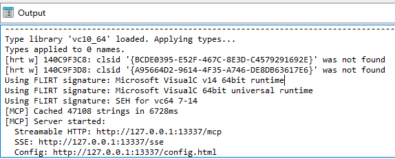

# IDA Pro MCP 配置


## mrexodia/ida-pro-mcp

- https://github.com/mrexodia/ida-pro-mcp


**环境准备**

- **IDA Pro**（推荐 9 以上版本，本示例使用 **9.1：** ida-pro_92_x64win.exe）
- **MCP 服务端：**github.com/mrexodia/ida-pro-mcp
- **Python 3.11+**


#### MCP 服务端安装

1. **安装 IDA Pro MCP 包：**

   ```bash
   pip install --upgrade git+https://github.com/mrexodia/ida-pro-mcp
   ```

2. **配置 MCP 服务器并安装 IDA 插件：**

   ```bash
   ida-pro-mcp --install
   ```

3. **获取 MCP 服务端的配置文件：**

   ```bash
   ida-pro-mcp --config
   ```

4. **配置 MCP 连接：**

   ```json
   {
     "mcpServers": {
       "github.com/mrexodia/ida-pro-mcp": {
         "type": "http",
         "url": "http://127.0.0.1:13337/mcp"
       }
     }
   }
   ```


#### MCP 使用

启动 **IDA Pro** 并加载程序，点击左上角的 **Edit --> Plugins --> MCP Ctrl+Alt+M**



等待左下角出现以下输出说明 **MCP** 服务已经成功运行了




## Captain-AI-Hub/IDA-MCP

