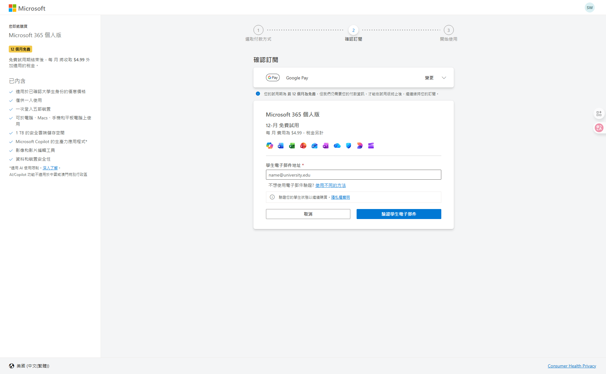
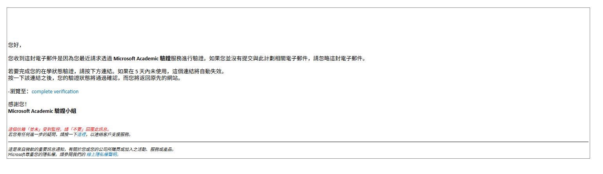
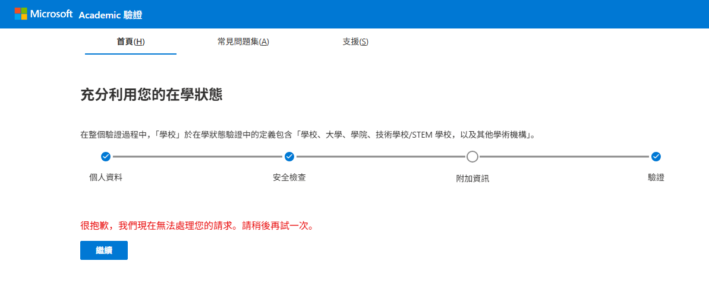
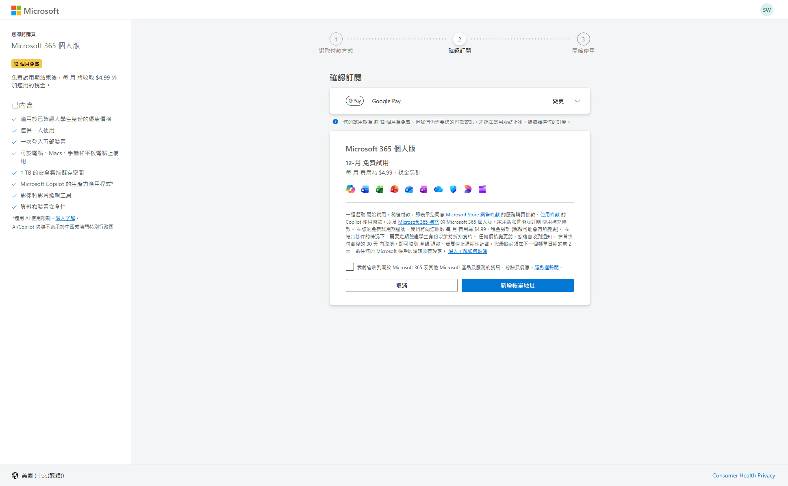
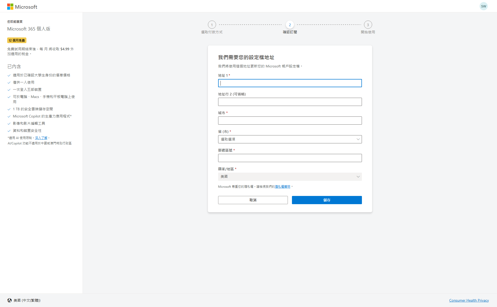
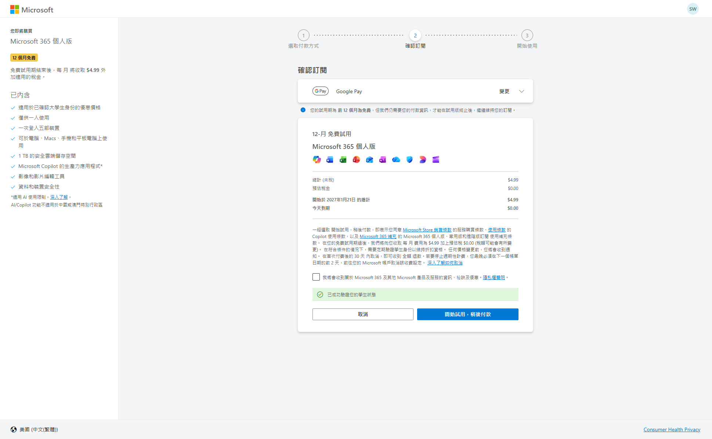
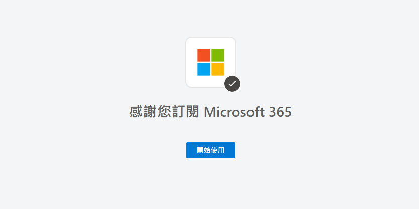
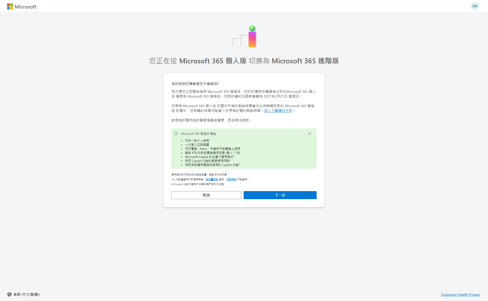
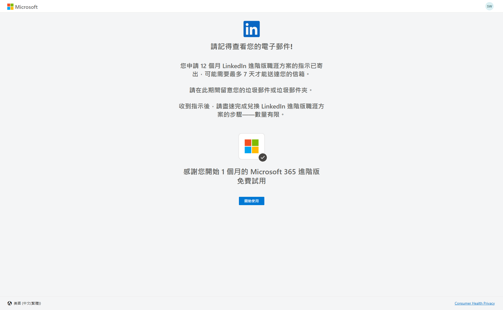
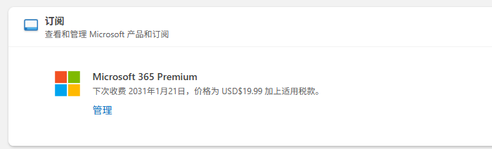

# Office365教育优惠五年领取

所需资料：

- 美区节点
- 境外银行卡（Visa、万事达）
- Google 账户
- 教育邮箱

## 前提

修改 Microsoft 账户国家为美国：https://account.microsoft.com/profile

提前在 Google Pay 中绑定银行卡：https://wallet.google.com/wallet/u/0/paymentmethods

## 流程

> [!IMPORTANT]
>
> 链接要按顺序点击，第一个过了再买第二个
>

### 链接一

访问：https://checkout.microsoft365.com/acquire/purchase?language=zh-TW&market=US&requestedDuration=Month&scenario=microsoft-365-student&client=poc&campaign=StudentFree12M

**选择 Google Pay支付（必需，不然无法多领几年）**

填写教育邮箱，并前往教育邮箱查看邮件

点击邮件中的链接，如果出现这个错误，尝试重新打开链接，并刷新上面第一个链接

此时，如果第一个链接的界面中的蓝色按钮变成“新增账单地址”，则表示验证通过了，

使用[美国地址生成](https://www.meiguodizhi.com/)，生成免税州地址【**阿拉斯加州**（Alaska）、**特拉华州**（Delaware）、**蒙大拿州**（Montana）、**新罕布什尔州**（New Hampshire）、俄勒冈州（Oregon）】

填写地址，继续下一步，显示“已成功驗證您的學生狀態”，点击开始使用按钮

点击“开始使用”按钮，等待调用 Google Pay 付款信息验证成功，

### 链接二

打开链接：https://checkout.microsoft365.com/acquire/purchase?language=zh-TW&market=US&requestedDuration=Month&scenario=microsoft-365-premium&client=poc&campaign=StudentPremiumFree12M

如果打开失败，尝试重新访问链接

显示的是一个月，流程基本一样，重复之前的步骤即可

点击“开始使用”，跳转到账户首页查看

