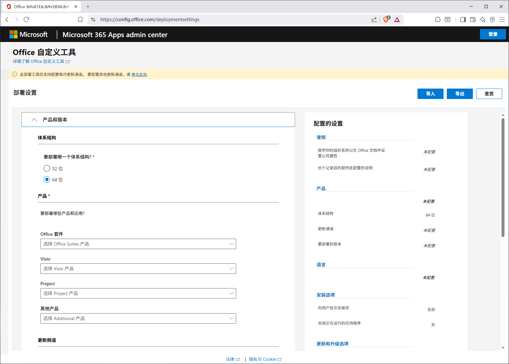
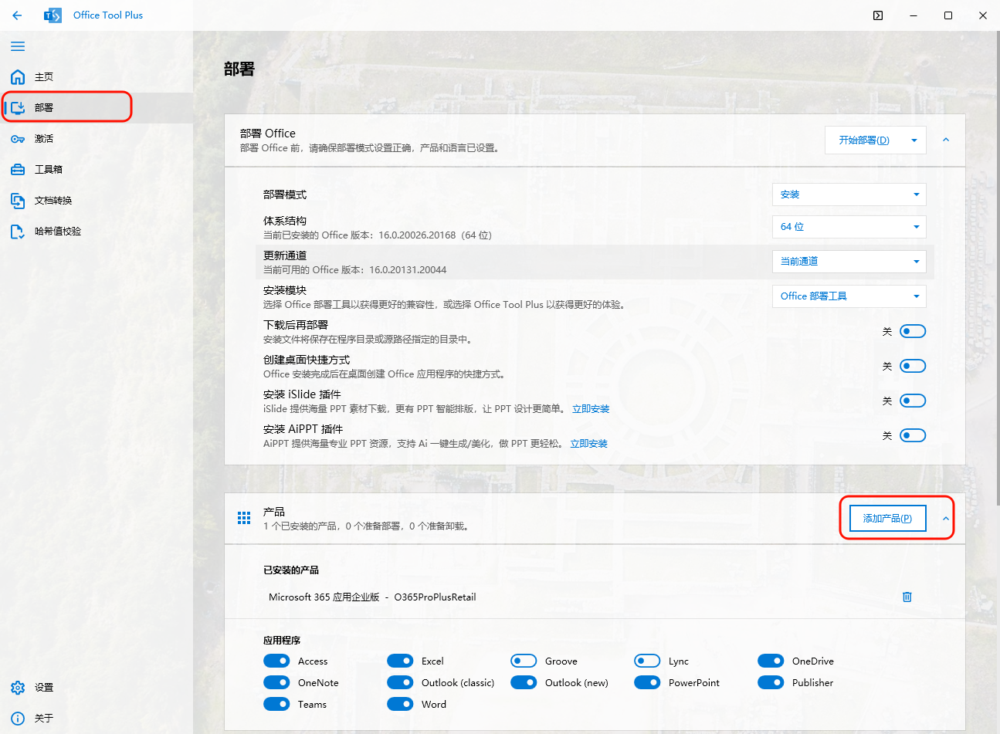
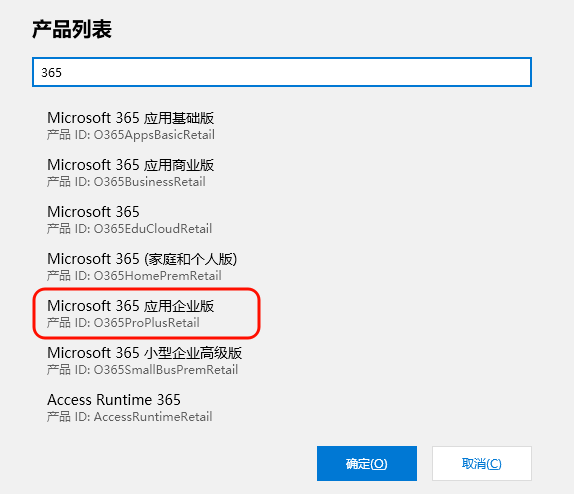
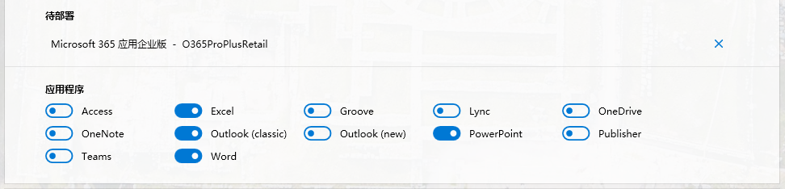
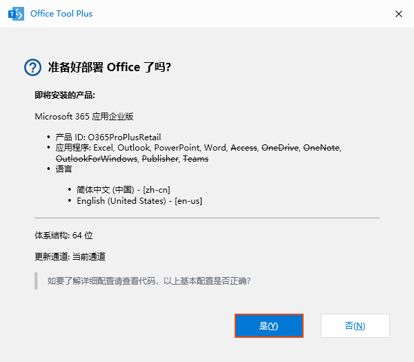
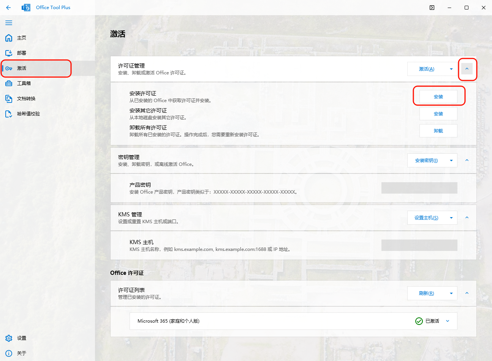
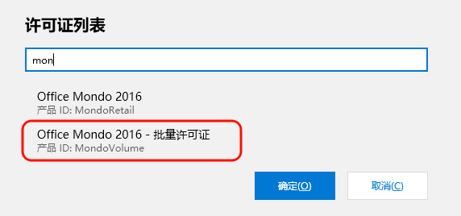

有两种 Office 安装方式：

- 使用微软官方的 Office 部署工具(ODT) 实现 Office 的定制化安装

- 使用 Office Tool Plus 可实现 Office 的定制化安装 【推荐】


## 使用 Office 部署工具(ODT) 安装


### 下载 Office 部署工具

[从 Microsoft 下载中心](https://go.microsoft.com/fwlink/p/?LinkID=626065)下载 Office 部署工具。

下载文件后，运行自解压缩可执行文件，其中包含 Office 部署工具可执行文件 (setup.exe) 和一个示例配置文件 (configuration.xml)。

### 使用 Office 部署工具

ODT 包含 2 个文件：`setup.exe` 和 `configuration.xml`。 若要使用该工具，请编辑配置文件以定义所需选项，然后从命令行运行 setup.exe。

使用官方 [Office 配置自定义工具](https://config.office.com/deploymentsettings) 创建配置文件



---

## 使用 Office Tool Plus 安装

### 下载 Office Tool Plus

Office Tool Plus 是一个强大且实用的 Office 部署工具，可以快捷、方便地安装、激活和管理 Office

下载地址：https://www.officetool.plus/

### 安装 Office

点击左侧栏目的“**部署**”，点击 **添加产品**



选择 **Microsoft 365 企业应用版**（这是功能最全的版本），点击“**确定**”：



勾选/取消勾选你需要/不需要的应用组件



点击“**开始部署**”：


点击“是”，开始部署：



等待下载完成，窗口显示“一切已就绪”，点击“**关闭**”，安装完成：

---

### 激活Office

#### 清除激活信息

点击左侧栏目的“**激活**”，点击“**许可证管理**”右边“**激活**”按钮内的三角，点击“**清除激活信息**”：


确认弹窗，点击“**是**”，清除旧版本 Office 的激活信息


等待 Office Tool Plus 弹出弹窗（卸载的产品密钥和许可证视你选择安装的软件数量而定），点击“**确定**”，卸载完成：


点击左侧栏目的“**工具箱**”，点击“**重置 Office 为默认设置**“的“**重置**“按钮，清除旧版本 Office 的设置：


右下角弹出“**修复成功**”弹窗，重置完成：


#### 一键激活

点击软件界面右上角的命令按钮或者按下快捷键 Ctrl + Shift + P，打开命令框：


复制下面的命令，在弹出的命令框中粘贴，然后点击确定：

```
ospp /unlics /unkeys /inslicid MondoVolume /sethst kms.akams.cn /setprt 1688 /act
```

此命令可一次性激活 Office, Visio, Project，同时适用 Win 7/8，能使用 Office 的所有功能。


#### 手动激活

点击左侧栏目的“**激活**”，点击“许可证管理”右边“**激活**”按钮内的三角，点击“**安装许可证**”



搜索 `mondo` 安装 `Office Mondo 2016 - 批量许可证`



在 **KMS 主机** 处填入kms 服务器地址 `kms.akams.cn`，然后点击 **设置主机**


最后点击最上方的 **激活** 按钮进行激活


激活成功提示，现在你可以打开 Word 程序，会提醒接受许可协议，这意味着激活成功，在 **账户** 选项卡中也可以看到激活信息：

---


## Microsoft 365 激活为 Mondo 2016

Microsoft 365 是功能最多最新的office，采用订阅制，按年/月订阅付费。本身无法通过 KMS 激活，但可以给他安装 Mondo 2016 证书从而“曲线激活”。Mondo 2016 虽然名为 2016，但功能却比 2019/2021还要多，相当于 Microsoft 365 离线版，除了部分云功能（例如OneDrive）没有，其他和 Microsoft 365 基本一样，是最接近 Microsoft 365 的版本。

### **安装Mondo 2016证书**

首先找到证书存放的位置，一般是在`C:\Program Files (x86)\Microsoft Office\root\Licenses16`或者`C:\Program Files\Microsoft Office\root\Licenses16`目录下。总共7个证书，如下

```
MondoVL_KMS_Client-ppd.xrm-ms
MondoVL_KMS_Client-ul-oob.xrm-ms
MondoVL_KMS_Client-ul.xrm-ms
MondoVL_MAK-pl.xrm-ms
MondoVL_MAK-ppd.xrm-ms
MondoVL_MAK-ul-oob.xrm-ms
MondoVL_MAK-ul-phn.xrm-ms
```

执行如下命令安装上述证书：

```cmd
cscript %systemroot%\System32\slmgr.vbs /ilc "C:\Program Files\Microsoft Office\root\Licenses16\MondoVL_KMS_Client-ppd.xrm-ms"
cscript %systemroot%\System32\slmgr.vbs /ilc "C:\Program Files\Microsoft Office\root\Licenses16\MondoVL_KMS_Client-ul-oob.xrm-ms"
cscript %systemroot%\System32\slmgr.vbs /ilc "C:\Program Files\Microsoft Office\root\Licenses16\MondoVL_KMS_Client-ul.xrm-ms"
cscript %systemroot%\System32\slmgr.vbs /ilc "C:\Program Files\Microsoft Office\root\Licenses16\MondoVL_MAK-pl.xrm-ms"
cscript %systemroot%\System32\slmgr.vbs /ilc "C:\Program Files\Microsoft Office\root\Licenses16\MondoVL_MAK-ppd.xrm-ms"
cscript %systemroot%\System32\slmgr.vbs /ilc "C:\Program Files\Microsoft Office\root\Licenses16\MondoVL_MAK-ul-oob.xrm-ms"
cscript %systemroot%\System32\slmgr.vbs /ilc "C:\Program Files\Microsoft Office\root\Licenses16\MondoVL_MAK-ul-phn.xrm-ms"
```

### **安装 Mondo 2016 GVLK (KMS密钥) **

```cmd
cscript "C:\Program Files\Microsoft Office\Office16\OSPP.VBS" /inpkey:HFTND-W9MK4-8B7MJ-B6C4G-XQBR2
```

### **激活 Mondo 2016**

```cmd
cscript "C:\Program Files\Microsoft Office\Office16\OSPP.VBS" /sethst:kms.akams.cn
cscript "C:\Program Files\Microsoft Office\Office16\OSPP.VBS" /setprt:1688
cscript "C:\Program Files\Microsoft Office\Office16\OSPP.VBS" /act
cscript "C:\Program Files\Microsoft Office\Office16\OSPP.VBS" /dstatus
```

---

## 常见问题

1. **零售版 怎么转 批量版？**

参考 **清除激活信息** 章节，清除和重置现有的Office激活信息和密钥，然后安装对应批量授权版本密钥，再进行KMS激活即可。

2. KMS 激活命令运行时 报错“系统找不到指定的路径。”或“输入错误: 无法找到脚本文件”

常见安装目录：

```
Office365/Microsoft365  默认安装目录
32位版本：   cd C:\Program Files (x86)\Microsoft Office\root\Office16
64位版本：   cd C:\Program Files\Microsoft Office\root\Office16

Office2016、Office2019、LTSC2021、LTSC2024 默认安装目录
32位版本：   cd C:\Program Files (x86)\Microsoft Office\Office16
64位版本：   cd C:\Program Files\Microsoft Office\Office16

Office2013 默认安装目录
32位版本：   cd C:\Program Files (x86)\Microsoft Office\Office15
64位版本：   cd C:\Program Files\Microsoft Office\Office15

Office2010 默认安装目录
32位版本      cd C:\Program Files (x86)\Microsoft Office\Office14
64位版本：   cd C:\Program Files\Microsoft Office\Office14
```

根据目录运行激活命令：

```cmd
if exist "C:\Program Files\Microsoft Office\Office16\ospp.vbs" cd /d "C:\Program Files\Microsoft Office\Office16"
if exist "C:\Program Files (x86)\Microsoft Office\Office16\ospp.vbs" cd /d "C:\Program Files (x86)\Microsoft Office\Office16"
cscript ospp.vbs /inpkey:XJ2XN-FW8RK-P4HMP-DKDBV-GCVGB
cscript ospp.vbs /sethst:kms.akams.cn
cscript ospp.vbs /act
```

OR：

```powershell
$p = "C:\Program Files\Microsoft Office\Office16"
if (-not (Test-Path "$p\ospp.vbs")) { $p = "C:\Program Files (x86)\Microsoft Office\Office16" }
cd $p
cscript ospp.vbs /inpkey:XJ2XN-FW8RK-P4HMP-DKDBV-GCVGB
cscript ospp.vbs /sethst:kms.akams.cn
cscript ospp.vbs /act
```


## 参考链接

[配置 KMS 主机以激活批量许可版本的 Office - Office | Microsoft Learn](https://learn.microsoft.com/zh-cn/office/volume-license-activation/configure-a-kms-host-computer-for-office)

[用于基于 KMS 和 Active Directory 的 Office、Project 和 Visio 激活的 GVLK - Office | Microsoft Learn](https://learn.microsoft.com/zh-cn/office/volume-license-activation/gvlks)

[从云中部署 Microsoft 365 应用版 - Microsoft 365 Apps | Microsoft Learn](https://learn.microsoft.com/zh-cn/microsoft-365-apps/deploy/deploy-microsoft-365-apps-cloud)

[部署 Office LTSC 2024 - Office | Microsoft Learn](https://learn.microsoft.com/zh-cn/office/ltsc/2024/deploy)

[部署 Office 长期服务频道 (LTSC) 2021 - Office | Microsoft Learn](https://learn.microsoft.com/zh-cn/office/ltsc/2021/deploy)

[为 IT 专业人员部署 Office 2019 () - Office | Microsoft Learn](https://learn.microsoft.com/zh-cn/office/2019/deploy)
