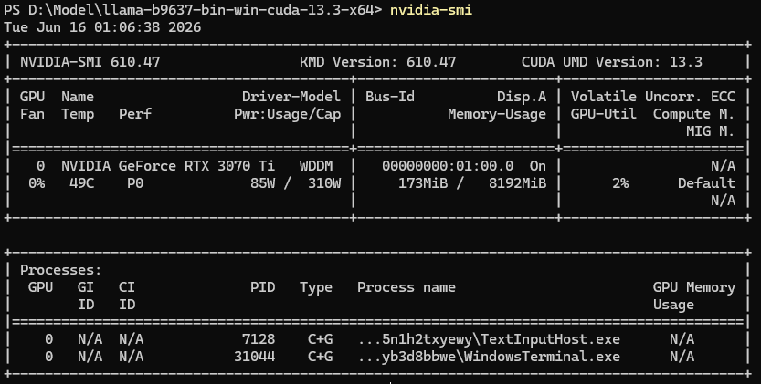
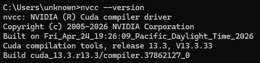
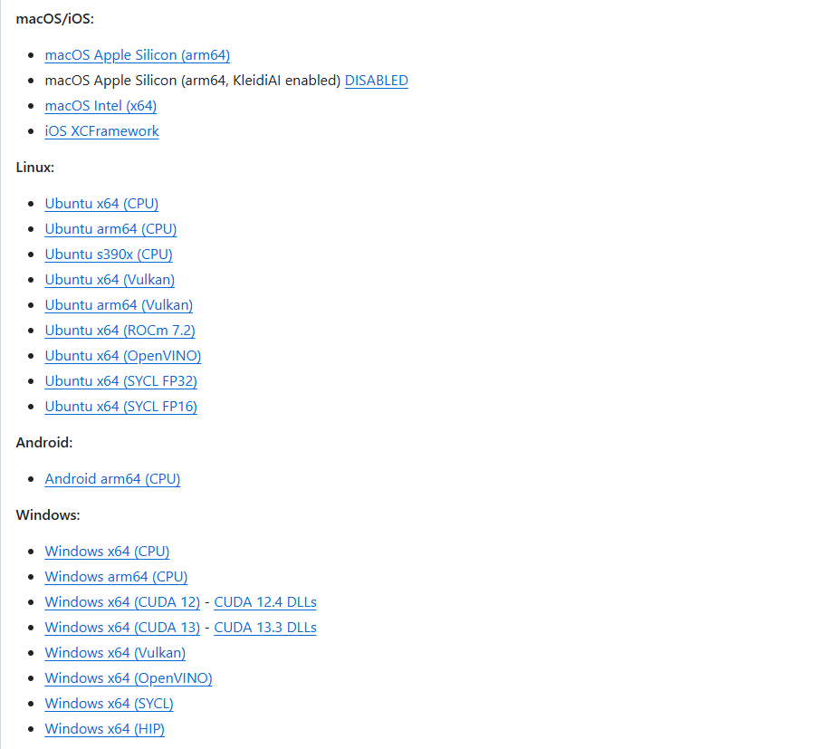
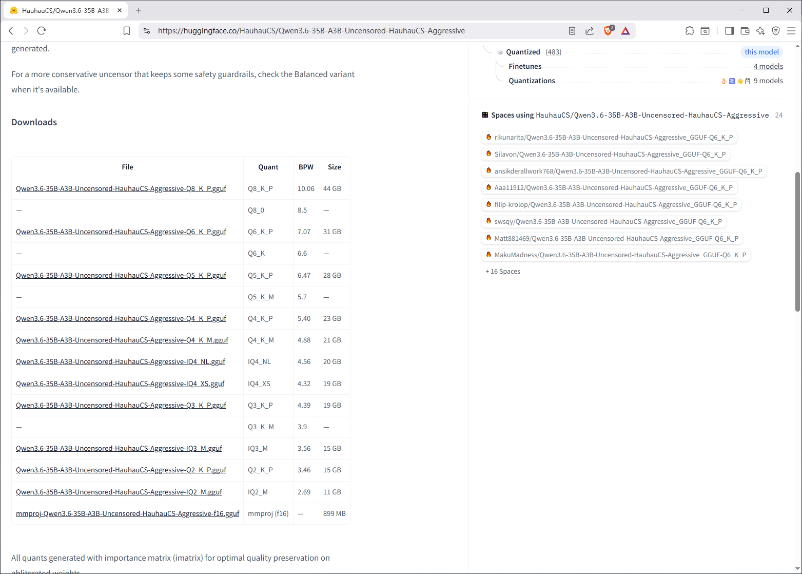
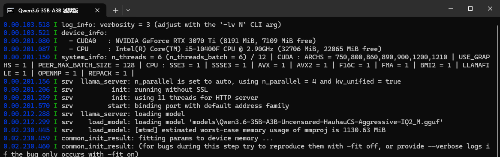
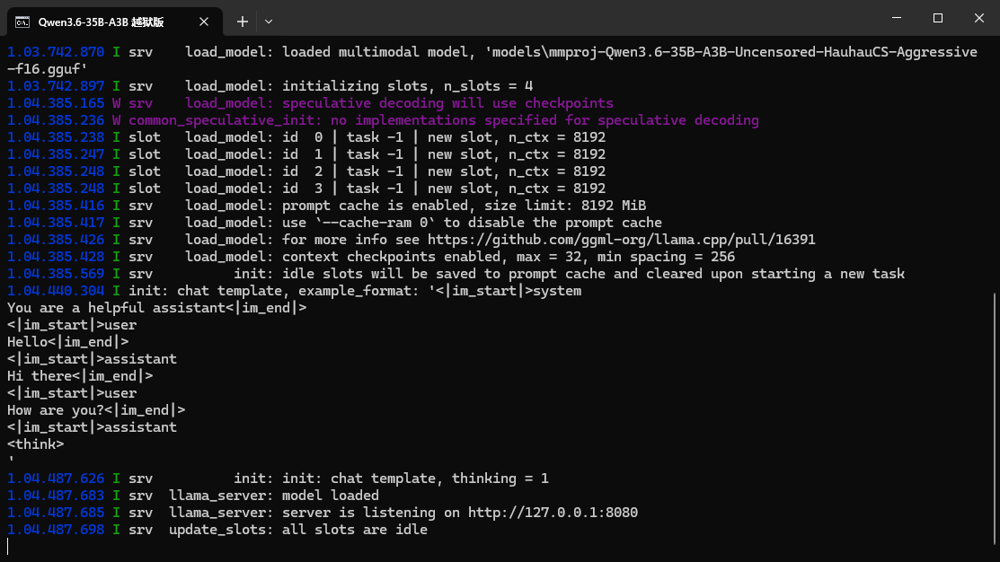
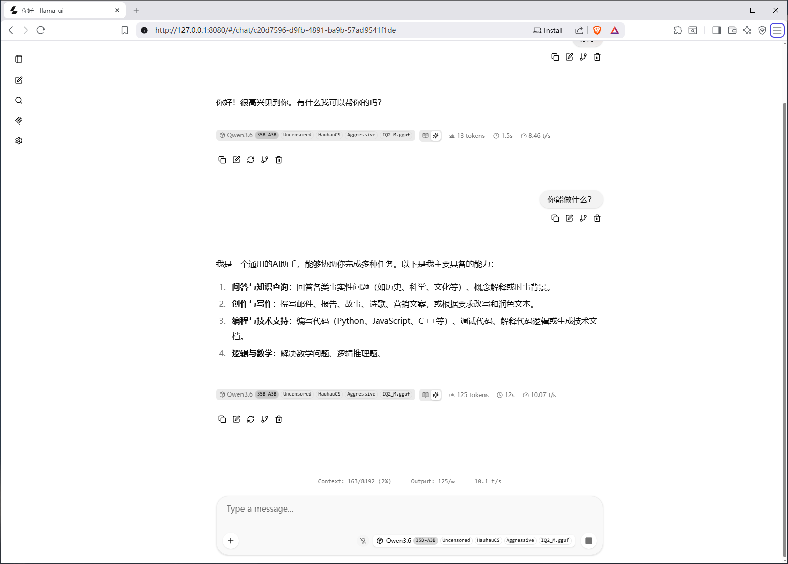
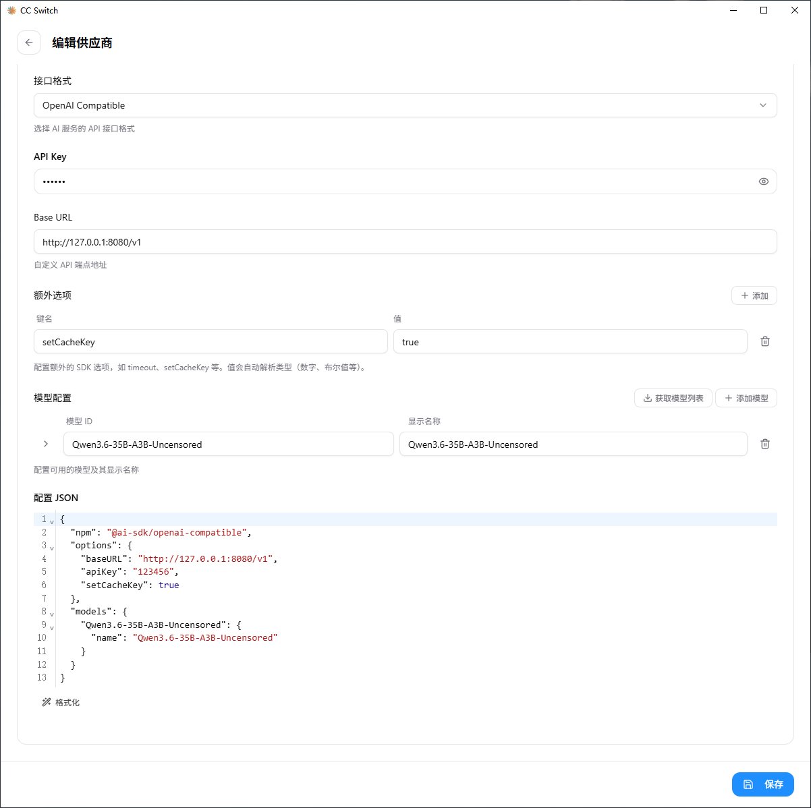
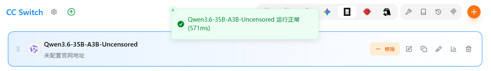
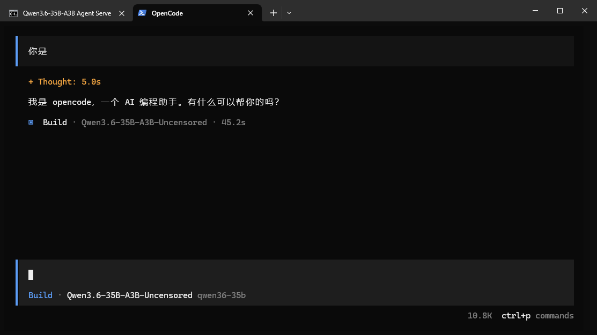

# 本地部署 Qwen3.6-35B-A3B 越狱版


## 环境准备

部署开始前先进行本地环境检查，以本机 Nvdia 显卡为例：

1. 查看 Nvdia 显卡驱动支持的 最高 CUDA 版本，powershell 运行以下命令：

   ```powershell
   nvidia-msi
   ```

   运行结果：

   

2. 查看实际安装的 CUDA Toolkit 版本，powershell 运行以下命令：

   ```powershell
   nvcc -version
   ```

   运行结果：

   

   > 如果没有输出 CUDA 版本号，则表示没有在主机环境检测到 CUDA ，请前往 https://developer.nvidia.com/cuda-downloads 下载安装 CUDA Toolkit


## llama.cpp 下载

前往 https://github.com/ggml-org/llama.cpp/releases 下载与你当前环境匹配的版本，支持N卡、A卡、I卡 、纯CPU

Nvdia 显卡下载带有 CUDA 支持（文件名中包含 `cuda`）的完整发布包，我这里选择的是“Windows x64 (CUDA 13) ”



### CUDA DLL 下载

同样在 llama.cpp 的 GitHub Releases 页面下载与你当前环境匹配的版本，并将解压出了 dll 文件放到  llama.cpp 解压目录中


## Qwen3.6 模型下载

前往  https://huggingface.co/HauhauCS/Qwen3.6-35B-A3B-Uncensored-HauhauCS-Aggressive  下载  Qwen3.6-35B-A3B  越狱版模型



**后缀解析**

- **Q (Quantization) + 数字 (2, 3, 4, 5, 6, 8)**：代表**量化精度（压缩程度）**。数字越大，模型体积越大，但保留的原始精度越高，模型越聪明；数字越小，体积越小，但“变傻”的风险越高。
- **K (K-quants)**：代表 llama.cpp 改进的量化算法。它通过优化分组策略提升了模型质量。**带有 K 的版本通常优于标准 Q 版本，是首选。**
- **M / P / S (变体)**：代表同一精度下的不同分配策略。
  - **M (Medium)**：中等策略，通常是**性价比之王**，在体积和质量之间取得了很好的平衡。
  - **P (Performance/Plus)**：性能增强版，质量略好于 M，但体积也稍大。
  - **S (Small)**：体积优先版，压缩得更小，但质量略差于 M。
- **IQ (Importance Quantization)**：重要性感知量化。它会智能识别并保留关键权重的高精度。例如 `IQ4_NL` 是一种在 4-bit 级别下质量非常好的特殊量化版本。
- **mmproj (Multi-Modal Projector)**：让模型能“看懂”图片（例如截图识别、OCR、看图说话），就必须下载这个文件（约 899 MB）并配合主模型使用。如果只进行纯文本对话，则不需要。


**模型选择**

#### **💻 极限低配（适合 6GB - 8GB 显存）**

- **推荐版本**：`IQ2_M` (11 GB) 或 `IQ3_M` (15 GB)
- 4-bit 量化是大多数用户的最佳选择，速度快且质量损失极小。`Q4_K_M` 是最稳定的标准版，`IQ4_NL` 则在同等体积下提供了更优的质量。

#### **🥇 甜点首选（适合 12GB - 16GB 显存）**

- **推荐版本**：`Q4_K_M` (21 GB) 或 `IQ4_NL` (20 GB)
- 4-bit 量化是大多数用户的最佳选择，速度快且质量损失极小。`Q4_K_M` 是最稳定的标准版，`IQ4_NL` 则在同等体积下提供了更优的质量。

#### **🚀 追求极致质量（适合 24GB+ 显存）**

- **推荐版本**：`Q5_K_M` (28 GB) 或 `Q6_K_P` (31 GB)
- 如果你的显卡是 RTX 3090/4090 (24GB) 或更大，可以选择 5-bit 或 6-bit 版本。它们非常接近原始精度，适合对回答逻辑和细节要求极高的场景。


这里根据自己显卡的显存进行下载，我的是 3070Ti-8G ，这里选择下载 IQ2_M

下载完成后，在  llama.cpp 的目录中新建 `models` 文件夹，并将模型文件复制到该目录下


## 原神启动（不是）


### Web UI 启动

准备一个 llama.cpp 的便携启动脚本，避免每次启动都要输入繁琐的参数:

新建一个 bat 文件，命名为：`Qwen3.6-35B-A3B 越狱版启动器.bat`，粘贴下方代码（自己替换脚本中模型名称为你下载的模型），存储编码选择 utf-8 格式。

```bat
@echo off
chcp 65001 >nul
title Qwen3.6-35B-A3B 越狱版

cd /d "%~dp0"

llama-server.exe ^
-m "models\Qwen3.6-35B-A3B-Uncensored-HauhauCS-Aggressive-IQ2_M.gguf" ^
--mmproj "models\mmproj-Qwen3.6-35B-A3B-Uncensored-HauhauCS-Aggressive-f16.gguf" ^
-ngl 999 ^
-c 8192 ^
-n 4096 ^
--host 127.0.0.1 ^
--port 8080

pause
```

启动参数说明：

|        参数        | 说明              | 描述                                                         |
| :----------------: | :---------------- | ------------------------------------------------------------ |
|        `-m`        | 模型加载（必填）  | 指定主模型文件的路径                                         |
|     `--mmproj`     | 多模态投影文件    | 指定视觉模型的加载路径                                       |
|     `-ngl 999`     | GPU 卸载层数      | 将模型的多少层计算卸载到 GPU 显存中运行。设置为 `999` 表示尽可能将全部层数都放到 GPU 上以实现最大加速。(如果显存爆满，建议将此数值调小，例如 `-ngl 20`，让剩余层数交由 CPU 处理） |
|     `-c 8192`      | 上下文窗口大小    | 设置模型能够处理的最大上下文长度（Token 数量）               |
|     `-n 4096`      | 最大生成 Token 数 | 限制模型单次回复时最多生成的 Token 数量                      |
| `--host 127.0.0.1` | 监听 IP 地址      | 指定服务器监听的 IP 地址                                     |
|   `--port 8080`    | 监听端口          | 指定服务运行的端口号                                         |


将该脚本放到  llama.cpp 的目录中，接着双击脚本启动，可观察启动日志是否输出GPU型号来判断是否在 GPU 上运行



等待输出 `Server is listening `



此时即可访问 `http://127.0.0.1:8080`




### **AI Agent** 对接

只需要在启动脚本中添加 API Key 鉴权参数，接着重新启动脚本

```
--api-key sk-local-agent-key
```

以  CC Switch 接入 OpenCode 为例，选择自定义配置供应商，填入以下信息：

- **Base URL**: `http://127.0.0.1:8080/v1`

- **API Key**: `sk-local-agent-key`（自行修改）

- **Model Name**: `Qwen3.6-35B-A3B-Uncensored-HauhauCS-Aggressive-IQ2_M.gguf`（可以填模型文件名，也可以缩写）



点击 ccswitch 自带的“测试模型”按钮



运行 OpenCode ，执行 /models 命令选择配置的模型名称




至此整个本地部署过程就完成了，至于能干些什么，就各自发挥吧，Have fun!
